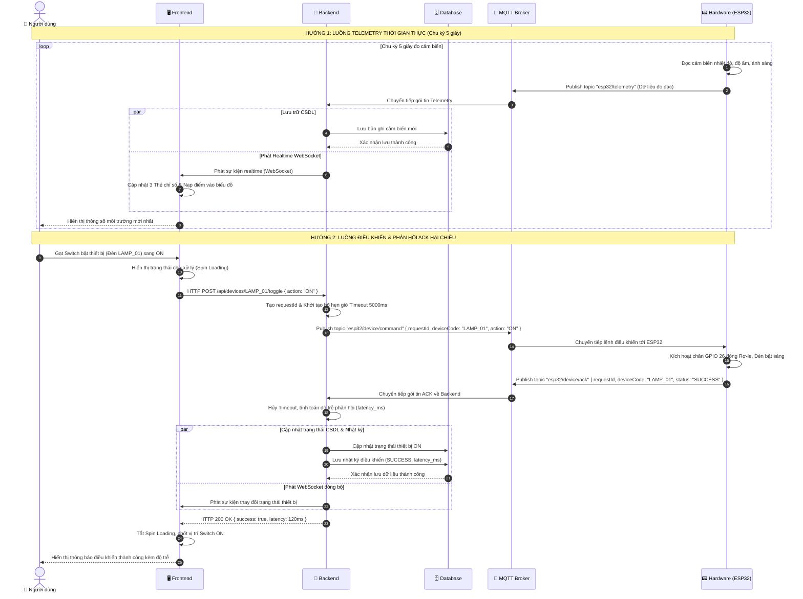
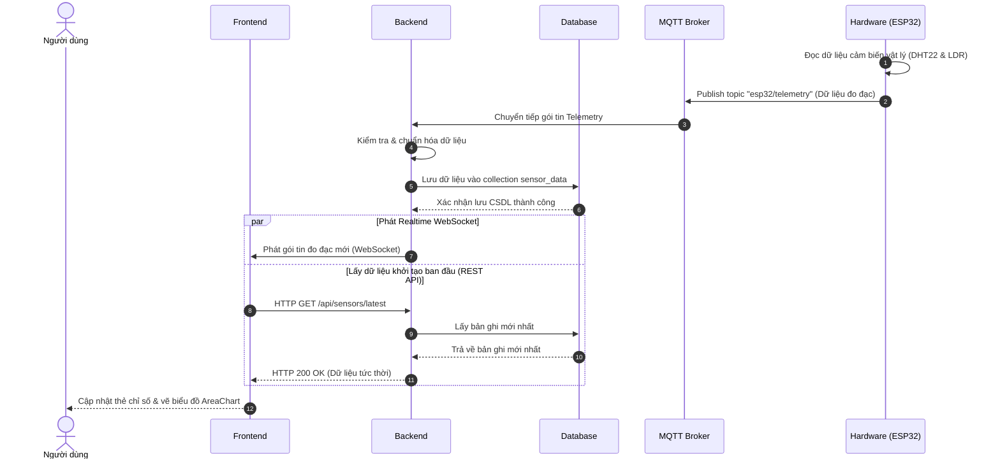

## 3.7. Sequence Diagram tổng quan

[CHÈN HÌNH 3.12]

```mermaid
sequenceDiagram
    autonumber
    actor User as 👤 Người dùng
    participant FE as 🖥️ Frontend
    participant BE as 🧠 Backend
    participant DB as 🗄️ Database
    participant MQTT as 📡 MQTT Broker
    participant HW as 📟 Hardware (ESP32)

    %% ==========================================
    %% HƯỚNG 1: TELEMETRY (HARDWARE -> UI)
    %% ==========================================
    Note over User,HW: HƯỚNG 1: LUỒNG TELEMETRY THỜI GIAN THỰC (Chu kỳ 5 giây)
    loop Chu kỳ 5 giây đo cảm biến
        HW->>HW: Đọc cảm biến nhiệt độ, độ ẩm, ánh sáng
        HW->>MQTT: Publish topic "esp32/telemetry" (Dữ liệu đo đạc)
        MQTT->>BE: Chuyển tiếp gói tin Telemetry
        par Lưu trữ CSDL
            BE->>DB: Lưu bản ghi cảm biến mới
            DB-->>BE: Xác nhận lưu thành công
        and Phát Realtime WebSocket
            BE->>FE: Phát sự kiện realtime (WebSocket)
            FE->>FE: Cập nhật 3 Thẻ chỉ số & Nạp điểm vào biểu đồ
        end
        FE-->>User: Hiển thị thông số môi trường mới nhất
    end

    %% ==========================================
    %% HƯỚNG 2: COMMAND & ACK (USER -> HARDWARE -> UI)
    %% ==========================================
    Note over User,HW: HƯỚNG 2: LUỒNG ĐIỀU KHIỂN & PHẢN HỒI ACK HAI CHIỀU
    User->>FE: Gạt Switch bật thiết bị (Đèn LAMP_01) sang ON
    FE->>FE: Hiển thị trạng thái chờ xử lý (Spin Loading)
    FE->>BE: HTTP POST /api/devices/LAMP_01/toggle { action: "ON" }
    
    BE->>BE: Tạo requestId & Khởi tạo bộ hẹn giờ Timeout 5000ms
    BE->>MQTT: Publish topic "esp32/device/command" { requestId, deviceCode: "LAMP_01", action: "ON" }
    MQTT->>HW: Chuyển tiếp lệnh điều khiển tới ESP32

    HW->>HW: Kích hoạt chân GPIO 26 đóng Rơ-le, Đèn bật sáng
    HW->>MQTT: Publish topic "esp32/device/ack" { requestId, deviceCode: "LAMP_01", status: "SUCCESS" }
    MQTT->>BE: Chuyển tiếp gói tin ACK về Backend

    BE->>BE: Hủy Timeout, tính toán độ trễ phản hồi (latency_ms)
    par Cập nhật trạng thái CSDL & Nhật ký
        BE->>DB: Cập nhật trạng thái thiết bị ON
        BE->>DB: Lưu nhật ký điều khiển (SUCCESS, latency_ms)
        DB-->>BE: Xác nhận lưu dữ liệu thành công
    and Phát WebSocket đồng bộ
        BE->>FE: Phát sự kiện thay đổi trạng thái thiết bị
    end

    BE-->>FE: HTTP 200 OK { success: true, latency: 120ms }
    FE->>FE: Tắt Spin Loading, chốt vị trí Switch ON
    FE-->>User: Hiển thị thông báo điều khiển thành công kèm độ trễ
```

---

## 3.8. Sequence Diagram – Đọc & Giám sát dữ liệu cảm biến

[CHÈN HÌNH 3.13]

```mermaid
sequenceDiagram
    autonumber
    actor User as Người dùng
    participant FE as Frontend
    participant BE as Backend
    participant DB as Database
    participant MQTT as MQTT Broker
    participant HW as Hardware (ESP32)

    HW->>HW: Đọc dữ liệu cảm biến vật lý (DHT22 & LDR)
    HW->>MQTT: Publish topic "esp32/telemetry" (Dữ liệu đo đạc)
    MQTT->>BE: Chuyển tiếp gói tin Telemetry
    BE->>BE: Kiểm tra & chuẩn hóa dữ liệu
    BE->>DB: Lưu dữ liệu vào collection sensor_data
    DB-->>BE: Xác nhận lưu CSDL thành công
    par Phát Realtime WebSocket
        BE->>FE: Phát gói tin đo đạc mới (WebSocket)
    and Lấy dữ liệu khởi tạo ban đầu (REST API)
        FE->>BE: HTTP GET /api/sensors/latest
        BE->>DB: Lấy bản ghi mới nhất
        DB-->>BE: Trả về bản ghi mới nhất
        BE-->>FE: HTTP 200 OK (Dữ liệu tức thời)
    end
    FE-->>User: Cập nhật thẻ chỉ số & vẽ biểu đồ AreaChart
```

